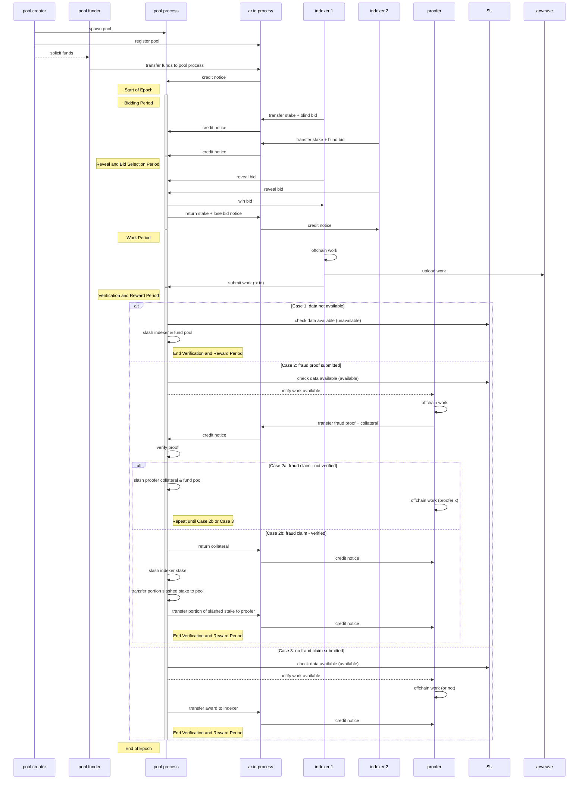

```mermaid

sequenceDiagram
    participant creator as pool creator
        participant funder as pool funder
    participant pool as pool process
    participant ario as ar.io process
    participant indexer1 as indexer 1
    participant indexer2 as indexer 2
    participant proofer as proofer
    participant su as SU
    participant arweave as arweave

    creator->>pool: spawn pool
    creator->>ario: register pool
    creator-->>funder: solicit funds
    funder->>ario: transfer funds to pool process
    ario->>pool:credit notice

    note left of pool: Start of Epoch

    activate pool
        note left of pool: Bidding Period
        indexer1->>ario: transfer stake + blind bid
        ario->>pool: credit notice
        indexer2->>ario: transfer stake + blind bid
        ario->>pool: credit notice
    deactivate pool

    activate pool
        note left of pool: Reveal and Bid Selection Period
        indexer1->>pool: reveal bid
        indexer2->>pool: reveal bid
        pool->>indexer1: win bid
        pool->>ario: return stake + lose bid notice
        ario->>indexer2: credit notice
    deactivate pool

    activate pool
        note left of pool: Work Period
        indexer1->>indexer1: offchain work
        indexer1->>arweave: upload work
        indexer1->>pool: submit work (tx id)
    deactivate pool

    activate pool
        note left of pool: Verification and Reward Period

        alt Case 1: data not available

            pool->>su: check data available (unavailable)
            pool->>pool: slash indexer & fund pool
            note right of pool: End Verification and Reward Period
        else Case 2: fraud proof submitted

            pool->>su: check data available (available)

            pool-->>proofer: notify work available

            proofer->>proofer: offchain work
            proofer->>ario: transfer fraud proof + collateral
            ario->>pool:credit notice
            pool->>pool: verify proof

            alt Case 2a: fraud claim - not verified
                pool->>pool: slash proofer collateral & fund pool
                proofer->>proofer: offchain work (proofer x)
                note right of pool: Repeat until Case 2b or Case 3
            else Case 2b: fraud claim - verified
                pool->>ario: return collateral
                ario->>proofer: credit notice
                pool->>pool: slash indexer stake
                pool->>pool: transfer portion slashed stake to pool
                pool->>ario: transfer portion of slashed stake to proofer
                ario->>proofer: credit notice
                note right of pool: End Verification and Reward Period
            end

        else Case 3: no fraud claim submitted
            pool->>su: check data available (available)
            pool-->>proofer: notify work available
            proofer->>proofer: offchain work (or not)
            pool->>ario: transfer award to indexer
            ario->>proofer: credit notice
            note right of pool: End Verification and Reward Period
        end
    deactivate pool

        note left of pool: End of Epoch
```
