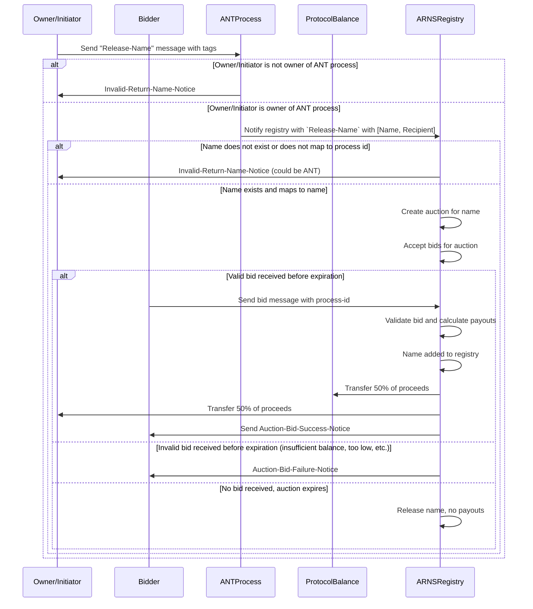

```mermaid
sequenceDiagram
participant Owner/Initiator
participant Bidder
participant ANTProcess
participant ProtocolBalance
participant ARNSRegistry

    Owner/Initiator ->> ANTProcess: Send "Release-Name" message with tags
    alt Owner/Initiator is not owner of ANT process
        ANTProcess ->> Owner/Initiator: Invalid-Return-Name-Notice
    else Owner/Initiator is owner of ANT process
        ANTProcess ->> ARNSRegistry: Notify registry with `Release-Name` with [Name, Recipient]
        alt Name does not exist or does not map to process id
            ARNSRegistry ->> Owner/Initiator: Invalid-Return-Name-Notice (could be ANT)
        else Name exists and maps to name
            ARNSRegistry ->> ARNSRegistry: Create auction for name
            ARNSRegistry ->> ARNSRegistry: Accept bids for auction
            alt Valid bid received before expiration
                    Bidder ->> ARNSRegistry: Send bid message with process-id
                    ARNSRegistry ->> ARNSRegistry: Validate bid and calculate payouts
                    ARNSRegistry ->> ARNSRegistry: Name added to registry
                    ARNSRegistry ->> ProtocolBalance: Transfer 50% of proceeds
                    ARNSRegistry ->> Owner/Initiator: Transfer 50% of proceeds
                    ARNSRegistry ->> Bidder: Send Auction-Bid-Success-Notice
            else Invalid bid received before expiration (insufficient balance, too low, etc.)
                    ARNSRegistry ->> Bidder: Auction-Bid-Failure-Notice
            else No bid received, auction expires
                ARNSRegistry ->> ARNSRegistry: Release name, no payouts
            end
        end
    end
```
