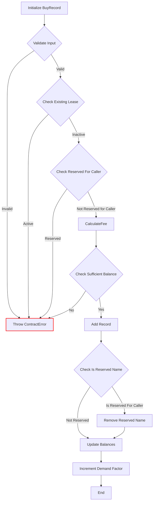

# Buy Record

```mermaid
graph TD
    classDef redBorder stroke:#ff0000,stroke-width:2px;
    Init[Initialize BuyRecord] --> Validate{Validate Input}
    Validate -- Invalid --> Error[Throw ContractError]
    Validate -- Valid --> CheckLease{Check Existing Lease}
    CheckLease -- Active --> Error
    CheckLease -- Inactive --> CheckReserved{Check Reserved For Caller}
    CheckReserved -- Not Reserved for Caller --> CalculateFee
    CheckReserved -- Reserved --> Error
    CalculateFee --> CheckSufficient{Check Sufficient Balance}
    CheckSufficient -- Yes --> AddRecord[Add Record]
    CheckSufficient -- No --> Error
    AddRecord --> IsReserved{Check Is Reserved Name}
    IsReserved -- Is Reserved For Caller --> DeleteReserve[Remove Reserved Name]
    IsReserved -- Not Reserved --> UpdateBalance[Update Balances]
    DeleteReserve --> UpdateBalance
    UpdateBalance --> UpdateDemandFactor[Increment Demand Factor]
    UpdateDemandFactor --> End
    class Error redBorder
```
