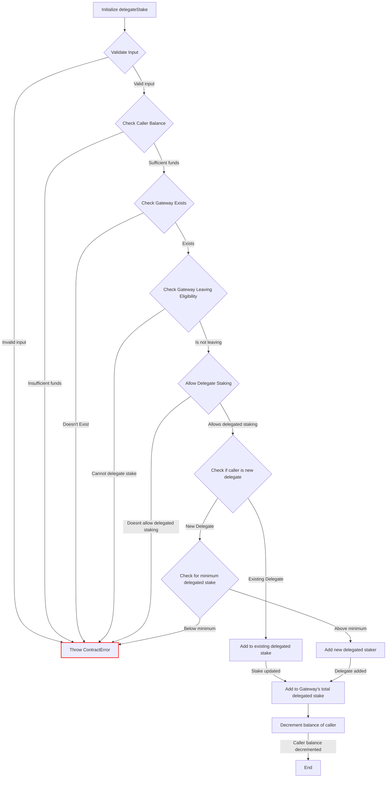
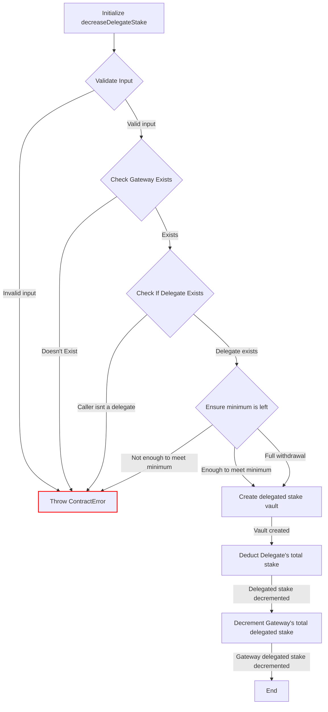

# Delegates

## DelegateStake

```mermaid
graph TD
    classDef redBorder stroke:#ff0000,stroke-width:2px;
    Init[Initialize delegateStake] --> ValidateInput{Validate Input}
    ValidateInput -- Invalid input --> Error[Throw ContractError]
    ValidateInput -- Valid input --> CheckBalance{Check Caller Balance}
    CheckBalance -- Insufficient funds --> Error
    CheckBalance -- Sufficient funds --> CheckGateway{Check Gateway Exists}
    CheckGateway -- Exists --> CheckStatus{Check Gateway Leaving Eligibility}
    CheckGateway -- Doesn't Exist --> Error
    CheckStatus -- Is not leaving --> CheckAllowDelegatedStaking{Allow Delegate Staking}
    CheckStatus -- Cannot delegate stake --> Error
    CheckAllowDelegatedStaking -- Doesnt allow delegated staking --> Error
    CheckAllowDelegatedStaking -- Allows delegated staking --> CheckNewDelegate{Check if caller is new delegate}
    CheckNewDelegate -- New Delegate --> CheckMinimumDelegatedStake{Check for minimum delegated stake}
    CheckNewDelegate -- Existing Delegate --> AddToExistingDelegatedStake[Add to existing delegated stake]
    AddToExistingDelegatedStake -- Stake updated --> AddGatewayDelegatedStake
    CheckMinimumDelegatedStake -- Below minimum --> Error
    CheckMinimumDelegatedStake -- Above minimum --> AddDelegatedStaker[Add new delegated staker]
    AddDelegatedStaker -- Delegate added --> AddGatewayDelegatedStake[Add to Gateway's total delegated stake]
    AddGatewayDelegatedStake --> DeductCallerBalance[Decrement balance of caller]
    DeductCallerBalance -- Caller balance decremented --> End
    End
    class Error redBorder
```

## DecreaseStake

```mermaid
graph TD
    classDef redBorder stroke:#ff0000,stroke-width:2px;
    Init[Initialize decreaseDelegateStake] --> ValidateInput{Validate Input}
    ValidateInput -- Invalid input --> Error[Throw ContractError]
    ValidateInput -- Valid input --> CheckGateway{Check Gateway Exists}
    CheckGateway -- Exists --> CheckExistingDelegate{Check If Delegate Exists}
    CheckGateway -- Doesn't Exist --> Error
    CheckExistingDelegate -- Delegate exists --> CheckMinimumStake{Ensure minimum is left}
    CheckExistingDelegate -- Caller isnt a delegate --> Error
    CheckMinimumStake -- Enough to meet minimum --> CreateVault[Create delegated stake vault]
    CheckMinimumStake -- Full withdrawal --> CreateVault[Create delegated stake vault]
    CheckMinimumStake -- Not enough to meet minimum --> Error
    CreateVault[Create delegated stake vault] -- Vault created --> DeductDelegatedStake[Decrement Delegate's total stake]
    DeductDelegatedStake[Deduct Delegate's total stake] -- Delegated stake decremented --> DeductGatewayDelegatedStake[Decrement Gateway's total delegated stake]
    DeductGatewayDelegatedStake -- Gateway delegated stake decremented --> End
    End
    class Error redBorder
```
