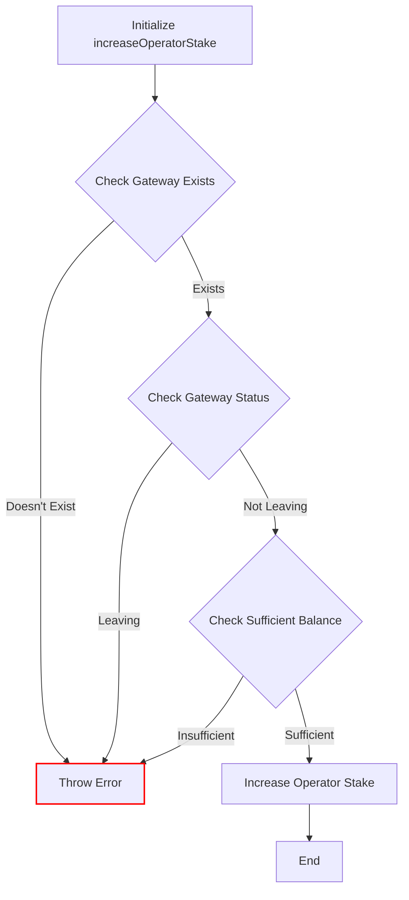
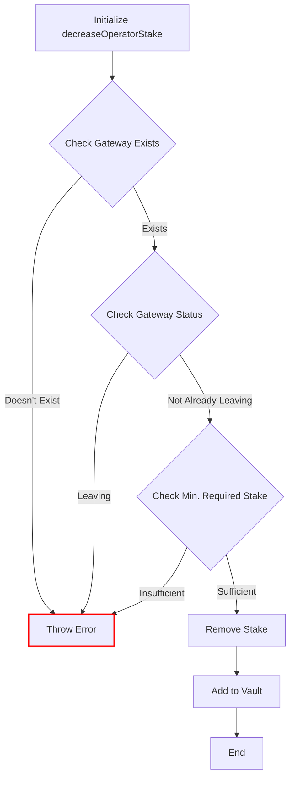
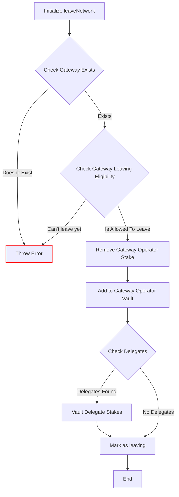

# Operators

## IncreaseOperatorStake

```mermaid
graph TD
    classDef redBorder stroke:#ff0000,stroke-width:2px;
    Init[Initialize increaseOperatorStake] --> CheckGateway{Check Gateway Exists}
    CheckGateway -- Exists --> CheckStatus{Check Gateway Status}
    CheckGateway -- Doesn't Exist --> Error[Throw Error]
    CheckStatus -- Not Leaving --> CheckBalance{Check Sufficient Balance}
    CheckStatus -- Leaving --> Error
    CheckBalance -- Sufficient --> IncreaseStake[Increase Operator Stake]
    CheckBalance -- Insufficient --> Error
    IncreaseStake --> End
    class Error redBorder
```

## DecreaseOperatorStake

```mermaid
graph TD
    classDef redBorder stroke:#ff0000,stroke-width:2px;
    Init[Initialize decreaseOperatorStake] --> CheckGateway{Check Gateway Exists}
    CheckGateway -- Exists --> CheckStatus{Check Gateway Status}
    CheckGateway -- Doesn't Exist --> Error[Throw Error]
    CheckStatus -- Not Already Leaving --> CheckMinStake{Check Min. Required Stake}
    CheckStatus -- Leaving --> Error
    CheckMinStake -- Sufficient --> RemoveStake[Remove Stake]
    CheckMinStake -- Insufficient --> Error
    RemoveStake --> AddVault[Add to Vault]
    AddVault --> End
    class Error redBorder
```

## LeaveNetwork

```mermaid
graph TD
    classDef redBorder stroke:#ff0000,stroke-width:2px;
    Init[Initialize leaveNetwork] --> CheckGateway{Check Gateway Exists}
    CheckGateway -- Exists --> CheckStatus{Check Gateway Leaving Eligibility}
    CheckGateway -- Doesn't Exist --> Error[Throw Error]
    CheckStatus -- Is Allowed To Leave --> RemoveGatewayStake[Remove Gateway Operator Stake]
    CheckStatus -- Can't leave yet --> Error
    RemoveGatewayStake --> AddGatewayOperatorVault[Add to Gateway Operator Vault]
    AddGatewayOperatorVault --> CheckForDelegates{Check Delegates}
    CheckForDelegates -- Delegates Found --> AddDelegatedStakerVaults[Vault Delegate Stakes]
    AddDelegatedStakerVaults --> SetLeavingStatus[Mark as leaving]
    CheckForDelegates -- No Delegates --> SetLeavingStatus
    SetLeavingStatus --> End
    class Error redBorder
```
