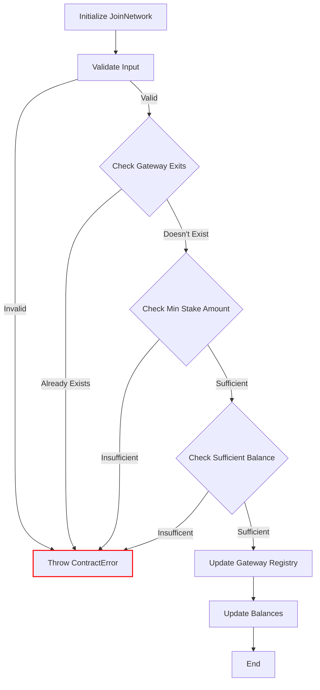

# JoinNetwork

```mermaid
graph TD
    classDef redBorder stroke:#ff0000,stroke-width:2px;
    Init[Initialize JoinNetwork] --> Validate[Validate Input]
    Validate -- Valid --> CheckGateway{Check Gateway Exits}
    Validate -- Invalid --> Error[Throw ContractError]
    CheckGateway -- Doesn't Exist --> CheckMinStake{Check Min Stake Amount}
    CheckGateway -- Already Exists --> Error
    CheckMinStake -- Sufficient --> CheckBalance{Check Sufficient Balance}
    CheckMinStake -- Insufficient --> Error
    CheckBalance -- Sufficient --> UpdateGAR[Update Gateway Registry]
    CheckBalance -- Insufficent --> Error
    UpdateGAR --> UpdateBalances[Update Balances]
    UpdateBalances --> End
    class Error redBorder
```
