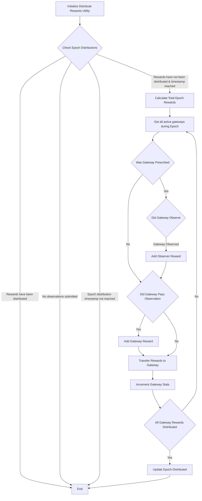

# Reward Distribution

```mermaid
graph TD
    classDef redBorder stroke:#ff0000,stroke-width:2px;
    Init[Initialize Distribute Rewards Utility] --> CheckObservedEpochs{Check Epoch Distributions}
    CheckObservedEpochs -- Rewards have not been distributed & timestamp reached --> CalculateEpochRewards[Calculate Total Epoch Rewards]
    CheckObservedEpochs -- Rewards have been distributed --> End
    CheckObservedEpochs -- No observations submitted --> End
    CheckObservedEpochs -- Epoch distribution timestamp not reached --> End
    CalculateEpochRewards --> GetEligibleGateways[Get all active gateways during Epoch]
    GetEligibleGateways --> B{Was Gateway Prescribed}
    B -- No --> DidGatewayPass{Did Gateway Pass Observation}
    B -- Yes --> CheckGatewayObservation{Did Gateway Observe}
    CheckGatewayObservation -- Gateway Observed --> IncrementObserverReward[Add Observer Reward]
    IncrementObserverReward --> DidGatewayPass
    DidGatewayPass -- Yes --> IncrementReward[Add Gateway Reward]
    IncrementReward --> DistributeRewards
    DidGatewayPass -- No --> DistributeRewards
    DistributeRewards[Transfer Rewards to Gateway] --> IncrementGatewayStats[Increment Gateway Stats]
    IncrementGatewayStats --> AllGatewayRewardsDistributed
    AllGatewayRewardsDistributed{All Gateway Rewards Distributed} -- Yes --> UpdateEpochDistributed[Update Epoch Distributed]
    AllGatewayRewardsDistributed -- No --> GetEligibleGateways
    UpdateEpochDistributed --> End
    class Error redBorder
```
