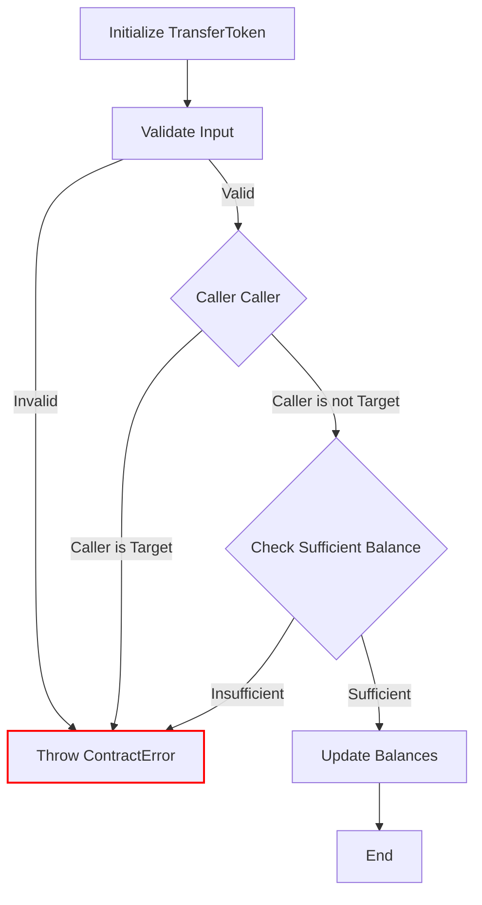

# Transfer

```mermaid
graph TD
    classDef redBorder stroke:#ff0000,stroke-width:2px;
    Init[Initialize TransferToken] --> Validate[Validate Input]
    Validate -- Valid --> CheckCaller{Caller Caller}
    Validate -- Invalid --> Error[Throw ContractError]
    CheckCaller -- Caller is Target --> Error
    CheckCaller -- Caller is not Target --> CheckBalance{Check Sufficient Balance}
    CheckBalance -- Sufficient --> UpdateBalances[Update Balances]
    CheckBalance -- Insufficient --> Error
    UpdateBalances --> End
    class Error redBorder
```
