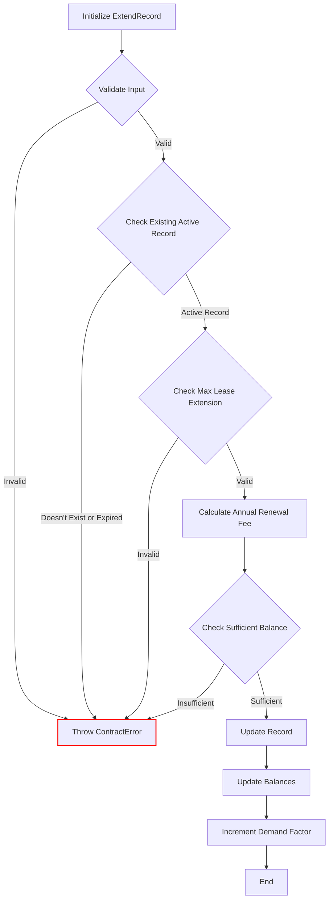

# Extend Lease

```mermaid
graph TD
    classDef redBorder stroke:#ff0000,stroke-width:2px;
    Init[Initialize ExtendRecord] --> Validate{Validate Input}
    Validate -- Valid --> CheckRecord{Check Existing Active Record}
    Validate -- Invalid --> Error[Throw ContractError]
    CheckRecord -- Active Record --> CheckMaxLease{Check Max Lease Extension}
    CheckRecord -- Doesn't Exist or Expired --> Error
    CheckMaxLease -- Valid --> CalculateFee[Calculate Annual Renewal Fee]
    CheckMaxLease -- Invalid --> Error
    CalculateFee --> CheckBalance{Check Sufficient Balance}
    CheckBalance -- Sufficient --> UpdateRecord[Update Record]
    CheckBalance -- Insufficient --> Error
    UpdateRecord --> UpdateBalances[Update Balances]
    UpdateBalances --> IncrementDemand[Increment Demand Factor]
    IncrementDemand --> End
    class Error redBorder
```
