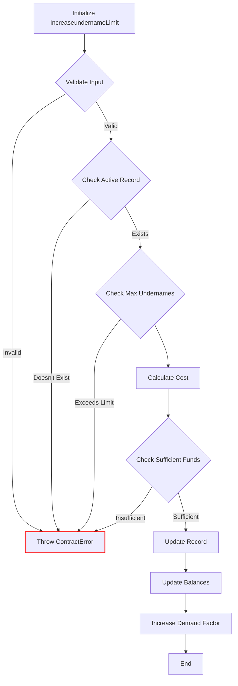

# IncreaseUndernameLimit

```mermaid 
graph TD
    classDef redBorder stroke:#ff0000,stroke-width:2px;
    Init[Initialize IncreaseundernameLimit] --> ValidateInput{Validate Input}
    ValidateInput -- Valid --> CheckRecord{Check Active Record}
    ValidateInput -- Invalid --> Error
    CheckRecord -- Exists --> CheckMaxUndernames{Check Max Undernames}
    CheckRecord -- Doesn't Exist --> Error[Throw ContractError]
    CheckMaxUndernames -- Exceeds Limit --> Error
    CheckMaxUndernames --> CalculateCost[Calculate Cost]
    CalculateCost --> CheckFunds{Check Sufficient Funds}
    CheckFunds -- Sufficient --> UpdateRecord[Update Record]
    CheckFunds -- Insufficient --> Error
    UpdateRecord --> UpdateBalances[Update Balances]
    UpdateBalances --> IncreaseDemand[Increase Demand Factor]
    IncreaseDemand --> End
    class Error redBorder
```
