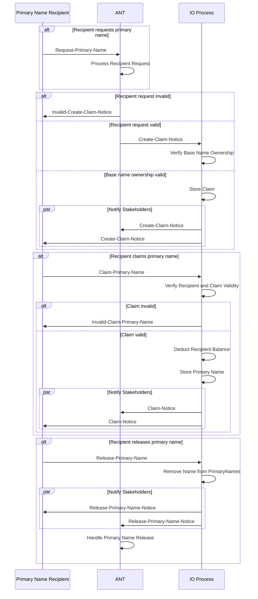

```mermaid
sequenceDiagram
    participant Recipient as Primary Name Recipient
    participant ANT
    participant IO_Process as IO Process

    alt Recipient requests primary name
        Recipient->>ANT: Request-Primary-Name
        ANT->>ANT: Process Recipient Request
    end

    alt Recipient request invalid
        ANT->>Recipient: Invalid-Create-Claim-Notice
    else Recipient request valid
        ANT->>IO_Process: Create-Claim-Notice
        IO_Process->>IO_Process: Verify Base Name Ownership
    else Base name ownership valid
        IO_Process->>IO_Process: Store Claim
        par Notify Stakeholders
            IO_Process->>ANT: Create-Claim-Notice
            IO_Process->>Recipient: Create-Claim-Notice
        end
    end

    alt Recipient claims primary name
        Recipient->>IO_Process: Claim-Primary-Name
        IO_Process->>IO_Process: Verify Recipient and Claim Validity

        alt Claim invalid
            IO_Process->>Recipient: Invalid-Claim-Primary-Name
        else Claim valid
            IO_Process->>IO_Process: Deduct Recipient Balance
            IO_Process->>IO_Process: Store Primary Name
            par Notify Stakeholders
                IO_Process->>ANT: Claim-Notice
                IO_Process->>Recipient: Claim-Notice
            end
        end
    end

    alt Recipient releases primary name
        Recipient->>IO_Process: Release-Primary-Name
        IO_Process->>IO_Process: Remove Name from PrimaryNames
        par Notify Stakeholders
            IO_Process->>Recipient: Release-Primary-Name-Notice
            IO_Process->>ANT: Release-Primary-Name-Notice
        end
        ANT->>ANT: Handle Primary Name Release
    end

```
