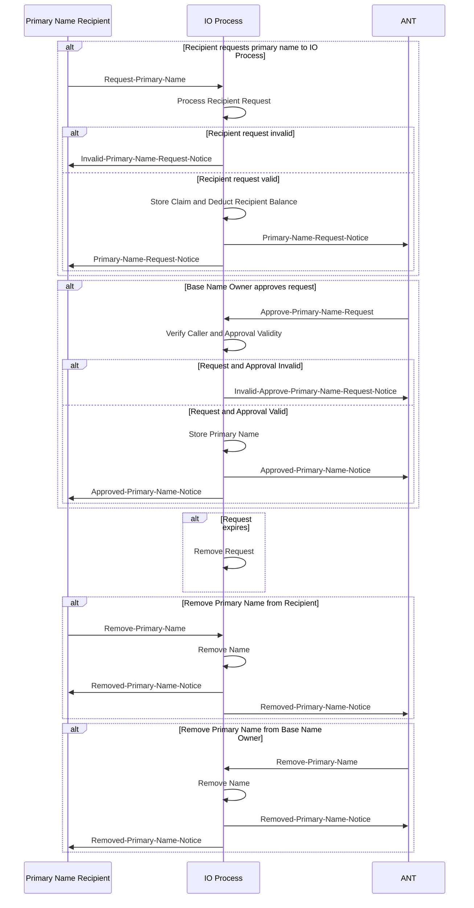

```mermaid
sequenceDiagram
    participant Recipient as Primary Name Recipient
    participant IO_Process as IO Process
    participant ANT

    alt Recipient requests primary name to IO Process
        Recipient->>IO_Process: Request-Primary-Name
        IO_Process->>IO_Process: Process Recipient Request
        alt Recipient request invalid
            IO_Process->>Recipient: Invalid-Primary-Name-Request-Notice
        else Recipient request valid
            IO_Process->>IO_Process: Store Claim and Deduct Recipient Balance
            IO_Process->>ANT: Primary-Name-Request-Notice
            IO_Process->>Recipient: Primary-Name-Request-Notice
        end
    end

    alt Base Name Owner approves request
        ANT->>IO_Process: Approve-Primary-Name-Request
        IO_Process->>IO_Process: Verify Caller and Approval Validity

        alt Request and Approval Invalid
            IO_Process->>ANT: Invalid-Approve-Primary-Name-Request-Notice
        else Request and Approval Valid
            IO_Process->>IO_Process: Store Primary Name
            IO_Process->>ANT: Approved-Primary-Name-Notice
            IO_Process->>Recipient: Approved-Primary-Name-Notice
        end
    end

    alt Request expires
        IO_Process->>IO_Process: Remove Request
    end

    alt Remove Primary Name from Recipient
        Recipient->>IO_Process: Remove-Primary-Name
        IO_Process->>IO_Process: Remove Name
        IO_Process->>Recipient: Removed-Primary-Name-Notice
        IO_Process->>ANT: Removed-Primary-Name-Notice
    end

    alt Remove Primary Name from Base Name Owner
        ANT->>IO_Process: Remove-Primary-Name
        IO_Process->>IO_Process: Remove Name
        IO_Process->>ANT: Removed-Primary-Name-Notice
        IO_Process->>Recipient: Removed-Primary-Name-Notice
    end

```
