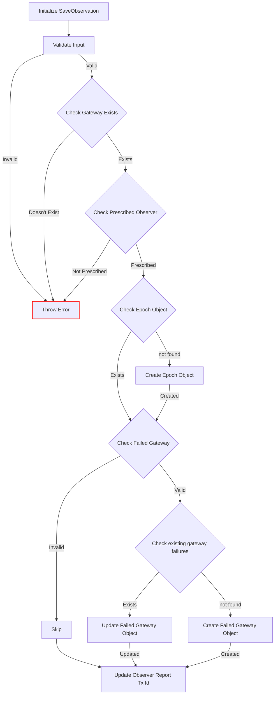

# SaveObservations

```mermaid
graph TD
    classDef redBorder stroke:#ff0000,stroke-width:2px;
    Init[Initialize SaveObservation] --> Validate[Validate Input]
    Validate -- Valid --> CheckGateway{Check Gateway Exists}
    Validate -- Invalid --> Error[Throw ContractError]
    CheckGateway -- Exists --> CheckPrescribedObserver{Check Prescribed Observer}
    CheckGateway -- Doesn't Exist --> Error[Throw Error]
    CheckPrescribedObserver -- Prescribed --> CheckEpoch{Check Epoch Object}
    CheckPrescribedObserver -- Not Prescribed --> Error
    CheckEpoch -- not found --> CreateEpoch[Create Epoch Object]
    CheckEpoch -- Exists --> CheckFailedGateway{Check Failed Gateway}
    CreateEpoch -- Created --> CheckFailedGateway{Check Failed Gateway}
    CheckFailedGateway -- Valid --> ProcessFailedGateway{Check existing gateway failures}
    CheckFailedGateway -- Invalid --> Skip
    Skip --> UpdateObserverReportTxId[Update Observer Report Tx Id]
    ProcessFailedGateway -- not found --> CreateFailedGateway[Create Failed Gateway Object]
    ProcessFailedGateway -- Exists --> UpdateFailedGateway[Update Failed Gateway Object]
    UpdateFailedGateway -- Updated --> UpdateObserverReportTxId[Update Observer Report Tx Id]
    CreateFailedGateway -- Created --> UpdateObserverReportTxId[Update Observer Report Tx Id]
    class Error redBorder
```
